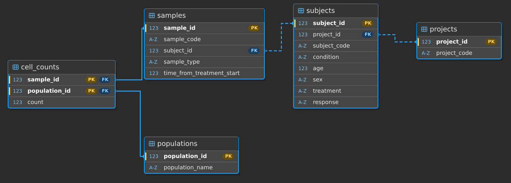

# trial-data-dashboard

End-to-end clinical data analysis pipeline and interactive visualization dashboard repo.

## Overview

This project analyzes longitudinal immune cell count data from a clinical-trial dataset. Each row in `cell-count.csv` represents one biological sample collected from one subject at a specific timepoint. The data include subject metadata, sample metadata, and cell counts for five immune cell populations:

- `b_cell`
- `cd8_t_cell`
- `cd4_t_cell`
- `nk_cell`
- `monocyte`

The pipeline performs four main tasks:

1. Loads the CSV into a normalized SQLite database
2. Builds a sample level relative frequency summary table
3. Compares responder versus nonresponder immune population frequencies in a clinically relevant subset using a repeated measures longitudinal model
4. Runs baseline subset queries for melanoma PBMC samples treated with miraclib

An interactive dashboard is included to explore the generated outputs locally.

---

## Repository structure

    .
    ├── cell-count.csv
    ├── load_data.py
    ├── generate_outputs.py
    ├── dashboard.py
    ├── Makefile
    ├── requirements.txt
    ├── notes_schema.md
    ├── README.md
    ├── assets/
    │   └── schema.svg
    └── outputs/

## Key files

- `load_data.py`  
  Initializes the SQLite database and loads the CSV into normalized tables.

- `generate_outputs.py`  
  Runs Parts 2-4 of the analysis pipeline and writes derived tables and plots to `outputs/`.

- `dashboard.py`  
  Starts the local interactive dashboard.

- `notes_schema.md`  
  Brief design notes describing the relational schema and validation logic.

- `Makefile`  
  Provides the required `setup`, `pipeline`, and `dashboard` commands.

---

## Database schema

The raw CSV is normalized into five tables:

### 1. `projects`
Stores one row per project.

- `project_id`
- `project_code`

### 2. `subjects`
Stores one row per subject within a project.

- `subject_id`
- `project_id`
- `subject_code`
- `condition`
- `age`
- `sex`
- `treatment`
- `response`

### 3. `samples`
Stores one row per biological sample.

- `sample_id`
- `sample_code`
- `subject_id`
- `sample_type`
- `time_from_treatment_start`

### 4. `populations`
Stores the immune cell population names.

- `population_id`
- `population_name`

Rows inserted:
- `b_cell`
- `cd8_t_cell`
- `cd4_t_cell`
- `nk_cell`
- `monocyte`

### 5. `cell_counts`
Stores one row per sample-population measurement.

- `sample_id`
- `population_id`
- `count`

### Schema diagram

---

## Data validation

Before loading the CSV, `load_data.py` performs several checks:

1. required columns are present
2. `sample` values are unique
3. subject-level metadata are consistent within each `(project, subject)` pair for:
   - `condition`
   - `age`
   - `sex`
   - `treatment`
   - `response`
4. immune cell counts are numeric and non-negative
5. `time_from_treatment_start` is numeric and integer-valued

The script stops with a clear error if any validation fails.

---

## Analysis workflow

### Part 1: Data loading
`load_data.py` reads `cell-count.csv`, validates the data, creates `trial_data.db`, and loads the normalized tables.

### Part 2: Relative-frequency summary table
`generate_outputs.py` creates a long-format summary table with one row per sample-population pair and the following columns:

- `sample`
- `total_count`
- `population`
- `count`
- `percentage`

This table is written to:

- `outputs/sample_population_frequencies.csv`

### Part 3: Responder vs non-responder analysis
The Part 3 analysis filters to:

- `condition = melanoma`
- `treatment = miraclib`
- `sample_type = PBMC`
- `response in {yes, no}`

Because the dataset is longitudinal and each subject contributes repeated samples across timepoints, Part 3 analysis uses a repeated measures model rather than treating all samples as independent.

The primary analysis uses:
- Binomial GEE
- subject-level clustering to account for repeated measures
- categorical timepoint
- response by timepoint interaction
- Benjamini-Hochberg correction for multiple testing across the five immune populations

Outputs:
- `outputs/part3_filtered_frequencies.csv`
- `outputs/part3_population_statistics_gee.csv`
- `outputs/part3_gee_model_summaries.txt`
- `outputs/part3_boxplots_by_time.png`

### Part 4: Baseline subset analysis
The Part 4 analysis filters to:

- `condition = melanoma`
- `treatment = miraclib`
- `sample_type = PBMC`
- `time_from_treatment_start = 0`

Outputs:
- `outputs/part4_baseline_samples.csv`
- `outputs/part4_samples_per_project.csv`
- `outputs/part4_subjects_by_response.csv`
- `outputs/part4_subjects_by_sex.csv`
- `outputs/part4_summary.txt`

Key result:
- Average B-cell count for melanoma male responders at baseline: **10401.28**

## How to run

### 1. Set up the environment

    make setup

### 2. Run the full pipeline

    make pipeline

This command should:
- create the SQLite database
- load the CSV
- generate the Part 2 summary table
- generate the Part 3 GEE statistics, model summaries, and boxplot
- generate the Part 4 subset outputs

### 3. Launch the dashboard

    make dashboard

This starts the local Streamlit dashboard.

---

## Manual run commands

The scripts can also be run directly:

    python load_data.py
    python generate_outputs.py
    streamlit run dashboard.py

---

## Environment

Tested with:
- Python 3.12.3 on Ubuntu 24.04.3 LTS

Dependencies are listed in `requirements.txt`.

---

## Dashboard

Local dashboard entry point:

    streamlit run dashboard.py

Dashboard link:
- To be added after final dashboard setup

---
